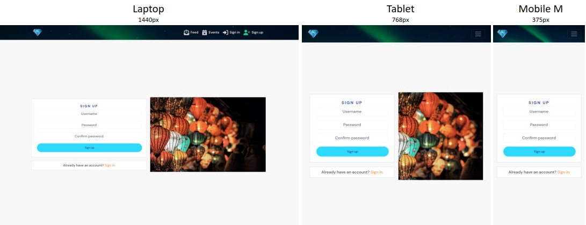
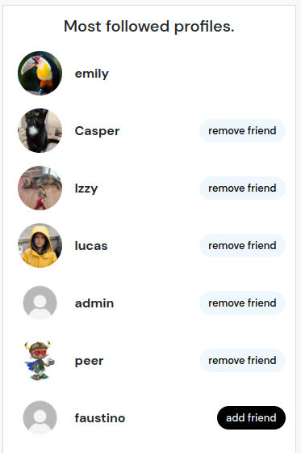
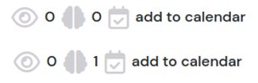
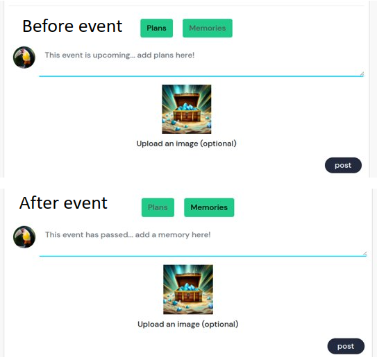
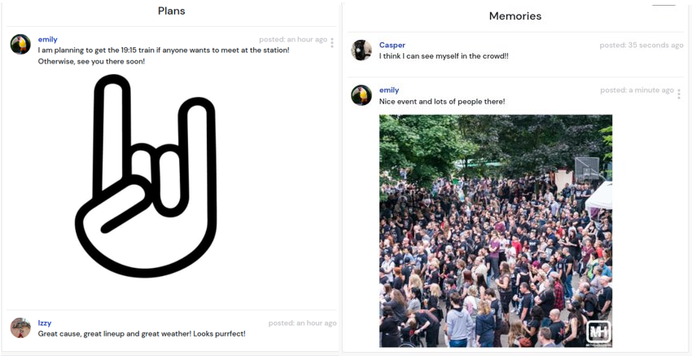

# EventTrove

EventTrove is a one-stop location for all your event discovery, sharing and organisation needs!
This interactive platform includes the option to view, add, edit and delete events and posts to share all kinds of events, big and small! A built in calendar allows visual organisation of your events to make sure you never miss an event!

The project has been split into two parts - the back-end constructed with [Django REST Framework](https://www.django-rest-framework.org/) and the frontend supercharged with [React](https://react.dev/).

More information on the back-end of the site can be found in the [back-end README](https://github.com/dragon-fire-fly/organisation_app_api).

Link to the live site - [EventTrove Live Site](https://organisation-app-frontend.herokuapp.com/)

Link to the live API - [EventTrove Live API](https://organisation-app-api.herokuapp.com/)

Link to the back-end repository - [EventTrove Back-End Repo](https://github.com/dragon-fire-fly/organisation_app_api)


## Project Goals

The primary goal of this project was to create a full stack application where users can view, add, edit and delete events. These events can be viewed as a list, individually and as a calendar view. Users can add posts about specific events to share and remind other users about the upcoming events, or add "memories" to events which have already passed, allowing different users to collate their experiences together in one place.

## Agile

These goals were split into four major themes and used as "Epics" for the agile development of the application. The Epics were as follows:

1. Account management
2. Posts
3. Events
4. Calendar


Each of the epics were then further split into "user stories", each of which representing one small, contained feature to be integrated into the site. Each user story contained an action statement in the format:

As a **role** I can **capability** so that **received benefit**

Each user story then had a list of acceptance criteria (what the user needs to be able to see/do to consider the story "completed") and a task list (what the developer needs to do in order to complete the story).

Each story was assigned to its respective Epic and classified into one of each of the four MoSCoW categories:

1. Must do. High priority. Features that the application needs in order to be used. Should account for approx 60% stories
2. Should do. Medium priority. Features that are not required for the feature to run, but significantly improve the application and/or user experience. Should account for approx 20% stories
3. Could do. Low priority. Features that are not required for the application to run, but would make a nice addition if included. Should account for the remaining ~20% stories
4. Won't do. This feature will not be added in this iteration of the application development.

In addition, "story points" were assigned to each of the user stories. These points denoted how difficult each user story is and/or how long it should take to complete, relative to the other stories. The points ranged from 1-8 on a logarithmic scale (i.e. the points available were 1, 2, 4 or 8, each being approximately double the difficulty and/or time requirement of the previous).

User story issues on Github were assigned labels to keep track of which MoSCoW prioritisation and number of story points each story has.  


As this project has both a backend and frontend component, each user story had associated frontend and backend tasks. Each repository, therefore, has its own github issue referencing each user story with the same user story and acceptance criteria, but with different tasks. The issue number for each user story is the same for both repositories and the corresponding user story to make tracking and review easy. Both sets of user stories can be found on the [associated project board](https://github.com/users/dragon-fire-fly/projects/5/views/1)

All user stories can be found in the [User Story grid](https://docs.google.com/spreadsheets/d/1-8NA5gjndIE3oYSuDAwsheJqryA4tlZQ6CmLRp4fKt8/edit?usp=sharing)

In the grid, each user story has details of it's EPIC, the user story number, the title, user story, acceptance criteria and both the backend and frontend tasks (with link to backend and frontend issues).

User stories (and bugs) were tracked using a Kanban board. This board has 3 columns - Todo, in progress and done. All user stories start life in the "to do" column and get moved, a maximum of five at a time, to the "in progress" column. When tasks are completed, they are moved to the "done" column and a new task(s) may be moved to the "in progress" column to be worked on.

An example of the kanban board during development and on completion of the application are shown below:

Kanban board in progress:  

Kanban board with all tasks completed:  


## UX

### Wireframes

Prior to starting work on the project, wireframes were designed to plan the basic structure and layout of some of the pages on the site. This helped when designing components in React to see how the components fit together an what differences (if any) are present for different screen sizes.

Wireframes were made for three screen sizes - mobile, tablet and desktop - to help guide styling from a "mobile-first" perspective.

<details> 
<summary>The wireframes for the project can be found in this toggle</summary>

- Event list view
  
- Event detail view
  
- Calendar page
  

</details>

### Design choices

#### Colour Scheme

The colour scheme for the project was kept extremely minimal as the focus of the site is user uploaded images and having bold colours throughout the site may detract or even clash with user uploaded image colours.

Colours were selected from the assets throughout the site to colour buttons and icons but otherwise most things were left with the default react-bootstrap colour scheme. This also improved accessibility by keeping contrast between backgrounds and text high.


#### Typography

DM-Sans was used as the typeface throughout the project as it is a sans-serif font designed to be readable at small text sizes and is compatible with FullCalendar. Reguls sans-serif is used as a backup font incase the google fonts typeface cannot be loaded.


### Logo/favicon

A basic logo featuring a blue gemstone was used as a "home" button on the navbar and for the favicon.


## Main features

### Existing

This project was developed using [React](https://react.dev/).

One of the main advantages of the React framework is the ability to create and use reusable components. This improves efficiency and readability of the code and allows global changes to be made with ease. This also reduces repetition in the code which is time consuming and liable to errors when a piece of code is updated and this must be correctly updated all areas where the original code was reused.

For this project, several reusable components were created and used throughout various pages. First I will detail the reusable components, then the pages in which some of these components were utilised.

#### Reusable Components

<details> 
<summary>click to expand</summary>

- Navbar

  The navbar is featured on every page and helps the user to effectively navigate through the site without having to enter routes into the url bar manually.

  The navbar renders different content depending on whether the user is logged in or not and features an image of the Northern Lights which can be seen when the dropdown menu is opened. From here, logged in users can add posts and events, navigate to the main posts and events pages, calendar, user's own profile and friends page. They can also nagivate the the filtered versions of posts and events (watched events, liked posts, friend's event and friends posts). They can also sign out of the site.

  Logged out users may only view the posts and events page, sign up and sign in.

  

- Dropdown  
  The `<MoreDropdown />` component is present on all editable and deletable components, including `<Post />`, `<Event />`, `<Comment />`, `<Memory />` and gives asset owners the option to edit and delete their assets. This component takes the handleEdit and handleShow (necessary for the confirm deletion modal) methods directly as props.

  The `<ProfileEditDropdown />` component is present on the `<Profile />` component and handles redirects to the change password, change username and edit profile pages.

  

- Asset  
  The `<Asset />` is a reusable component, useful for displaying a variety of, well... assets. This includes the image for the `<NotFound />` page, the images for upload and no results, and the loading spinners used throughout the site.

  

- Avatar  
  The `<Avatar />` component contains the profile image of users and is used in many other components. This includes each user's `<Profile />`, the `<Navbar />` component (as the dropdown menu toggle), part of the `<Profile />` component for the `<PopularProfiles />` sidebar, and at the top of each `<Post />` and `<Event />` asset.

  

- Event mini

  The `<EventMini />` component takes the key details from each event (the title, image and start date) and makes a small component which is used in the calendar event modals and upcoming events sidebar.

  

- Event modal  
  In the `<Calendar />` component, both the `dateClick` and `eventClick` functionalities from FullCalendar are used to determine user clicks on a whole day or on a specific event. When either of these is clicked, relevant information is passed to the `<EventModal />` component to render the relevant event(s) in the modal.

  If a specific event is clicked, the name of that event becomes the modal title and the specific event is displayed in the body through the `<EventMini />` component. The footer of the modal contains a cancel or "view event" button to take the user to that specific event detail page (where it can be edited or deleted, if the user owns the event).

  If a whole day is clicked, "Events for `<date clicked>`" becomes the modal title and each of the events taking place that day are listed as `<EventMini />` components. The footer of the modal contains a cancel or "add event" button to take the user to the "create new event" page so a user can create a new event. A future feature could automatically populate the new event form with the clicked date.

  

- Delete modal  
  The delete confirm modal is used in each of the places where assets can be deleted. This includes the `<Post />`, `<Event />`, `<Comment />` and `<Memory />` components. Each time the modal component is used, props in the form of a custom confirmation message and the specific `handleDelete` method are passed to the modal. This makes the modal completely interchangable for all delete instances.

  

- Selector switch  
  The selector switch was designed as there were a few places where multiple versions of a page could be displayed so I wanted a reusable component which could handle each of these instances. The switch has a left and right hand side and props are passed to it to determine the text rendered on each side, which side contains a link and the route for the link. This makes the component reusable on the profile page (for switching between a user's posts and events), on the main events page to switch between events in the past and those in the future and on individual events to switch between plans and memories.

  

</details>

#### Signup and Signin

<details> 
<summary>click to expand</summary>

- Signup

  The signup page was taken from the Code Institute Moments walkthrough project. The image was changed to a photo of lanterns but is otherwise unchanged from the walkthrough.

  

  - Signin

  The signin page was also taken from the Code Institute Moments walkthrough project. The image was changed to a photo of confetti at an event but is otherwise unchanged from the walkthrough.

  

</details>

#### 404 page

<details> 
<summary>click to expand</summary>

A '404 page not found' page replaces the default React 404 page. The `<NotFound />` component contains the `<Asset />` container with a custom "not found" image.

The 404 page will be rendered whenever a page not on the list of routes in `<App />` is entered, for example https://organisation-app-frontend.herokuapp.com/nonexistantpage/

Custom routing has also been added for when the API returns a 400 or 404 error, for example when a resource does not exist. This means that if a non-existant resource id is entered (in an otherwise valid route), the 404 page will be returned. For example https://organisation-app-frontend.herokuapp.com/events/999.

The 404 page contains a button which links back to the homepage (post feed page).


</details>

#### Posts

<details> 
<summary>click to expand</summary>

The posts page can be accessed through the base route of the application and is in a "feed" style with `<Post />` components from all users loaded on top of one another, starting from the most recent. 10 posts are loaded on page load, with another 10 being loaded when the user scrolls to the bottom, infinitely until the end of the post list is reached.
Each `<Post />` component contains the poster's avatar, name and a link to their profile, the date of posting, the image (if present), title, post content and a link to the event (if added). Each post can be liked by all logged in users except the post owner. Any logged in user may comment on a post.

- Posts page  
  
- Posts detail page  
  
- Create post page
  

  Posts can be liked and/or commented on by appropriately logged in users. Logged out users cannot like or comment on any posts, post owners can comment on but not like their own posts and logged in users who do not own the post may like/dislike and comment on any post they do not own.

    
  

  The posts page also contains the `<PopularProfiles/>` component which displays the most followed profiles.

  

</details>

#### Events

<details> 
<summary>click to expand</summary>

- Events page  
  
- Events detail page  
  
- Create event page  
    
  

  Events can be watched and/or have a plan/memory added by appropriately logged in users. Logged out users cannot watch or make a plan/memory on any events or add an event to their calendar, event owners can leave a plan/memory on but not watch their own events or remove them from their calendar and logged in users who do not own the event may watch/unwatch and leave plans/memories on any event they do not own, plus add that event to their calendar.

  - watch icon  
    
  - plan/memory icon  
    
  - add to calendar icon  
    

- watch event  
  Users can "watch" events if they do not own them. This adds them to their "watched events" page to make locating them again easier.  
  

- add event to calendar  
  Users can add and remove events they do not own to their calendar. This allows the event to be seen on the main Calendar page as well as the upcoming events sidepanel (if event is in the future)  
  

- upcoming events  
   Events in a user's calendar contain a boolean variable called "past" which indicates whether an event has already started or is upcoming. Upcoming events are displayed in a sidepanel on the "events" page and can be clicked to view more details of each individual event.  
  

 </details>

#### Plans and Memories

  <details> 
  <summary>click to expand</summary>
  Plans and Memories are variants of the same component, depending on whether they were created before or after the start date of their associated event. "Plans" are created when the asset is created before the start of the event, otherwise the asset is a "Memory".

The `<EventPage />` displays the detailed view of an event and also displays any plans that were created.
The `<EventPastPage />` also displays the detailed view of an event, but also displays the associated memories.
The `<SelectorSwtich />` component is reused here to switch between the two views.

Placeholder text is rendered conditionally depending on whether the event's start date has passed ("The event is upcoming... add plans here!" if so, "This event has passed... add a memory here!" if not).



Users may add a plan or memory with text content and an image (optional). The `<MemoryCreateForm />` component is embedded inline and plans/memories are added to the top of the list without causing a full page refresh.




The following shows the message displayed to the user when there are no plans or memories, depending on whether the event's start date is in the past or future and whether the user is logged in or not.  
 

</details>

#### Calendars

<details> 
<summary>click to expand</summary>
- Calendar


The calendar page makes heavy use of the [FullCalendar](https://fullcalendar.io/) component which generates the actual calendar grid. The project uses 3 plugins from FullCalendar to display different calendar views:

dayGridPlugin - provides the month and week views  
timeGridPlugin - provides the day view (split into hours)  
multiMonthPlugin - provides the year-at-a-glance view

```
initialView="dayGridMonth"
headerToolbar={{
  start: "today prevYear,prev,next,nextYear",
  center: "title",
  end: "multiMonthYear,dayGridMonth,timeGridWeek,timeGridDay",
}}
```


The project also uses the interactionPlugin to allow targeting of the day or a specific event. This is used for the day and event modals which display detail of event(s) to the user. More detail about these modals can be found in the [reusable component section](#reusable-components) above.


A custom pacman loading spinner makes this page a bit more fun as the API call can take a few seconds to complete  


</details>

#### Profiles

<details> 
<summary>click to expand</summary>

- Profile page
  
  

  The profile page is made up of several different components

  1. `<Avatar />`
  2. profile details supplied in`<ProfilePage />`
  3. `<ProfileEditDropdown />`
  4. `<SelectorSwitch />`
  5. `<Post />` or `<Event />` component, depending on which view is chosen
  6. `<PopularProfiles />`
     

  If it is another user's profile, the edit dropdown menu is not visible, but the button to add/remove friend is visible.
  The `<Asset />` component (the empty treasure chest here) is displayed if the user hasn't posted/added events yet.  
  

The dropdown menu on a user's own profile allows the following actions:

Change username  


Change password  


Update profile details  
Registered users can update their profile picture and profile details at any time with the profile edit form.  


</details>

### Validation

#### Sign up


#### Sign in


#### Images


#### Posts

The title field is madatory for post creation and so frontend validation is in place to prevent this field from being blank.


#### Events

The title, location and start and end time fields are madatory for event creation and so frontend validation is in place to prevent these fields from being blank. Privacy and event type are also mandatory, but these have default values and therefore are never blank and so do not cause validation errors.


There is also a custom validator to ensure that end time for an event is after the start time:  


handling user interaction

### Future Features

Link to google calendar (through API)
Link to google maps for location

## Testing

[All testing can be found in a seperate md file here](TESTING.md)

## Deployment

### Deployment to Heroku

This project uses [Heroku](https://www.heroku.com), a platform as a service (PaaS) that enables developers to build, run, and operate applications entirely in the cloud.

Deployment steps are as follows, after account setup:

- Select **New** in the top-right corner of your Heroku Dashboard, and select **Create new app** from the dropdown menu.
- Your app name must be unique, and then choose a region closest to you (EU or USA), and finally, select **Create App**.

Head into the 'Deploy' tab select GitHub as the 'deployment method', find your project repository and click 'Connect'.
Click 'Deploy branch' to trigger Heroku to start building the application. You can also enable **automatic deployment** if you wish.
Once you see the message saying 'build succeeded' you can click 'Open App' to see your application in the browser.

### Connecting to the API

In order to send and receive data to/from the API, the front and backend workspace need to be connected.

First, make sure that the API is successfully deployed to Heroku with the "CLIENT_ORIGIN" variable correctly set to the deployed URL of the **frontend project** so that it can recieve requests from the front-end (here https://organisation-app-frontend.herokuapp.com/). More details on API deployment may be found in the [API respository for this project](https://github.com/dragon-fire-fly/organisation_app_api#heroku-deployment).

Then follow these steps to connect the front-end to the API:

- In the frontend workspace, install the Axios library using the command 'npm install axios'.
- Create a folder called 'API' and inside it create a file called 'axiosDefaults'.
- Import axios at the top of the file
- Define the baseURL which is the unique URL of the deployed **API project** (here https://organisation-app-api.herokuapp.com/).
- Set the content-type header to multi-part/form-data as the API will need to deal with images as well as text in it's requests.
- Import axiosDefaults into App.js (`import "./api/axiosDefaults";`) so that it may be accessed globally.

### Local Deployment

This project can be cloned or forked in order to make a local copy on your own system.

#### Cloning

You can clone the repository by following these steps:

1. Go to the [GitHub repository](https://github.com/dragon-fire-fly/organisation_app_frontend)
2. Locate the Code button above the list of files and click it
3. Select if you prefer to clone using HTTPS, SSH, or GitHub CLI and click the copy button to copy the URL to your clipboard
4. Open Git Bash or Terminal
5. Change the current working directory to the one where you want the cloned directory
6. In your IDE Terminal, type the following command to clone my repository:
   - `git clone https://github.com/dragon-fire-fly/organisation_app_frontend.git`
7. Press Enter to create your local clone.

#### Forking

By forking the GitHub Repository, we make a copy of the original repository on our GitHub account to view and/or make changes without affecting the original owner's repository.
You can fork this repository by using the following steps:

1. Log in to GitHub and locate the [GitHub Repository](https://github.com/dragon-fire-fly/organisation_app_frontend/)
2. At the top of the Repository (not top of page) just above the "Settings" Button on the menu, locate the "Fork" Button.
3. Once clicked, you should now have a copy of the original repository in your own GitHub account!

## Technologies and Tools

- [HTML](https://en.wikipedia.org/wiki/HTML) used for the main site content.
- [CSS](https://en.wikipedia.org/wiki/CSS) used for the main site design and layout.
- [JavaScript](https://en.wikipedia.org/wiki/JavaScript) used to create the interactive elements of the website
- [React.js](<https://en.wikipedia.org/wiki/React_(software)>) used as the frontend framework

- [React Bootstrap](https://react-bootstrap.github.io/) - A CSS framework that helps build solid, responsive, mobile-first sites
- [Balsamiq](https://balsamiq.com/) used to create the wireframes
- [Git](https://git-scm.com) used for version control. (`git add`, `git commit`, `git push`)
- [GitHub](https://github.com) used for secure online code storage.
- [Heroku](https://www.heroku.com) used for hosting the deployed front-end site.
- [Visual Studio Code](https://code.visualstudio.com/) used as a local IDE for development.
- [Lighthouse](https://developer.chrome.com/docs/lighthouse/overview/) used to test site performance.
- [Google Chrome DevTools](https://developer.chrome.com/docs/devtools/) used to debug and test responsiveness.
- [Cloudinary](https://cloudinary.com/) used to host image files for the project.
- [HTML Validation](https://validator.w3.org/) used to validate HTML code
- [CSS Validation](https://jigsaw.w3.org/css-validator/) used to validate CSS code
- [ESLint](https://eslint.org/) used to lint JavaScript code
- [FullCalendar](https://fullcalendar.io/) used to generate the calendar component for the calendar page

## Credits

### Images

Lantern photo
https://www.pexels.com/photo/selective-focus-photography-of-lanterns-1313817/

Confetti photo
https://unsplash.com/photos/ZODcBkEohk8

Navbar image
https://images.pexels.com/photos/1933319/pexels-photo-1933319.jpeg

Images for resource not found, image upload placeholder and 404 page were created using [dream.ai](https://dream.ai/)

jpg images were converted to webp using [timy-img](https://tiny-img.com/webp/)

### Code references

https://react-bootstrap.github.io/components/modal/ - for creating modals
https://www.npmjs.com/package/react-spinners - for custom spinner

https://stackoverflow.com/questions/72301355/how-to-populate-select-options-from-an-api-call-in-react-js-on-page-load - for event drop down in postcreateform

https://stackoverflow.com/questions/38049966/get-image-preview-before-uploading-in-react - for uploading images without using useRef() hook

---

for FullCalendar
`npm install @fullcalendar/react @fullcalendar/core @fullcalendar/daygrid`

### Acknowledgements

- I would like to thank my Code Institute mentor, Martina Terlevic for her support throughout the development of this project.
- I would like to thank my previous Code Institute mentor, [Tim Nelson](https://github.com/TravelTimN). Although he isn't my mentor anymore, his previous support and guidance still helps me every day.
- I would like to thank the [Code Institute](https://codeinstitute.net) tutor team for their assistance with troubleshooting and debugging some project issues.
- I would like to thank the [Code Institute Slack community](https://code-institute-room.slack.com), particularly the class of May 2022, for the moral support; it kept me going during periods of self doubt and imposter syndrome.
- I would like to thank my husband (Christian Schmidt), for believing in me, and allowing me to make this transition into software development.
