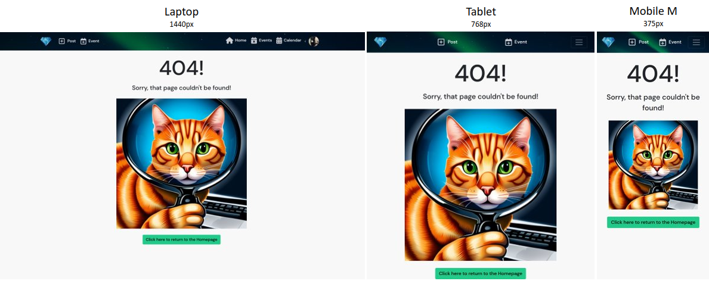

# EventTrove

EventTrove is a one-stop location for all your event discovery, sharing and organisation needs!
This interactive platform includes the option to view, add, edit and delete events and posts to share all kinds of events, big and small! A built in calendar allows visual organisation of your events to make sure you never miss an event!

The project has been split into two parts - the back-end constructed with [Django REST Framework](https://www.django-rest-framework.org/) and the frontend supercharged with [React](https://react.dev/).

More information on the back-end of the site can be found in the [back-end README](https://github.com/dragon-fire-fly/organisation_app_api).

Link to the live site - [EventTrove Live Site](https://organisation-app-frontend.herokuapp.com/)

Link to the live API - [EventTrove Live API](https://organisation-app-api.herokuapp.com/)

Link to the back-end repository - [EventTrove Back-End Repo](https://github.com/dragon-fire-fly/organisation_app_api)

## Project Goals

The primary goal of this project was to create a full stack application where users can view, add, edit and delete events. These events can be viewed as a list, individually and as a calendar view. Users can add posts about specific events to share and remind other users about the upcoming events, or add "memories" to events which have already passed, allowing different users to collate their experiences together in one place.

## Agile

These goals were split into four major themes and used as "Epics" for the agile development of the application. The epics were as follows:

1. Account management
2. Posts
3. Events
4. Calendar

Each of the epics were then further split into "user stories", each of which representing one small, contained feature to be integrated into the site. Each user story contained an action statement in the format:

As a **role** I can **capability** so that **received benefit**

Each user story then had a list of acceptance criteria (what the user needs to be able to see/do to consider the story "completed") and a task list (what the developer needs to do in order to complete the story).

Each story was assigned to its respective Epic and classified into one of each of the four MoSCoW categories:

1. Must do. Approx 60%
2. Should do. Approx 20%
3. Could do. Approx 20%
4. Won't do.

An example user story with acceptance criteria, task list, epic and MoSCoW assignment:

As this project has both a backend and frontend component, each user story had associated frontend and backend tasks. Each repository, therefore, has its own github issue referencing each user story with the same user story and acceptance criteria, but with different tasks. The issue number for each user story is the same for both repositories and the corresponding user story to make tracking and review easy. Both sets of user stories can be found on the [associated project board](https://github.com/users/dragon-fire-fly/projects/5/views/1)

Todo: Insert kanban screenshots here

All user stories can be found in this [google docs](https://docs.google.com/spreadsheets/d/1-8NA5gjndIE3oYSuDAwsheJqryA4tlZQ6CmLRp4fKt8/edit?usp=sharing) document.

## UX

### Wireframes

 

The wrieframes for the project can be found in this toggle

- Home page?

- Post list view

- Post detail view

- Event list view
  
- Event detail view
  
- Calendar page
  

- Profile page

### User Stories

### Site structure

### Design choices

- colour scheme
- typography

## Main features

### Existing

One of the main purposes of the React framework is the creation and use of reusable components. This improves efficiency and reability of the code and allows global changes to be made with ease. This also reduces repetition in the code which is time consuming and liable to errors when one piece of code is updated and this must be correctly updated all areas where the original code was reused.

For this project, several reusable components were created and used throughout various pages. First I will detail the reusable components, then the pages in which some of these components were utilised.

`< />`

 

Reusable Components

- Navbar

- Dropdown
  The `<MoreDropdown />` component is present on all editable and deletable components, including `<Post />`, `<Event />`, `<Comment />`, `<Memory />` and gives asset owners the option to edit and delete their assets. This component takes the handleEdit and handleShow (necessary for the confirma deletion modal) methods directly as props.

  The `<ProfileEditDropdown />` component is present on the `<Profile />`component and handles redirects to the change password, change username and edit profile pages.

  

- Asset
  The `<Asset />` is a reusable component, useful for displaying a variety of, well... assets. This includes the image for the `<NotFound />` page, the images for upload and no results, and the spinners used throughout the site.

  

- Avatar
  The `<Avatar />` component contains the profile image of users and is used in many other components. This includes each user's `<Profile />`, the `<Navbar />` component (as the dropdown menu toggle), part of the `<Profile />` component for the `<PopularProfiles />` sidebar, and at the top of each `<Post />` and `<Event />` asset.

  

- profile

- Event mini

  The `<EventMini />` component takes the key details from each event (the title, image and start date) and makes a small component which is used in the calendar event modals and upcoming events sidebar.

  

- Event modal
  In the `<Calendar />` component, both the `dateClick` and `eventClick` functionalities from FullCalendar are used to determine user clicks on a whole day or on a specific event. When either of these is clicked, relevant information is passed to the `<EventModal />` component to render the relevant event(s) in the modal.

  If a specific event is clicked, the name of that event becomes the modal title and the specific event is displayed in the body through the `<EventMini />` component. The footer of the modal contains a cancel or "view event" button to take the user to that specific event detail page (where it can be edited or deleted, if the user owns the event).

  If a whole day is clicked, "Events for `<date clicked>`" becomes the modal title and each of the events taking place that day are listed as `<EventMini />` components. The footer of the modal contains a cancel or "view event" button to take the user to the "create new event" page so a user can create a new event. A future feature could automatically populate the new event form with the clicked date.

  

- Delete modal  
  The delete confirm modal is used in each of the places where assets can be deleted. This includes the `<Post />`, `<Event />`, `<Comment />` and `<Memory />` components. Each time the modal component is used, props in the form of a custom confirmation message and the specific handleDelete method are passed to the modal. This makes the modal completely interchangable for all delete instances.  
  

  The selector switch was designed as there were multiple places where multiple versions of a page could be displayed so I wanted a reusable component which could handle each of these instances. The switch has a left and right hand side and props are passed to it to determine what text is rendered and which side has a link (and where the link leads). This makes the component reusable on the profile page (for switching between a user's posts and events) and on the main events page to switch between events in the past and those in the future.

- Selector switch  
  

 

Signup

 

Signin

 

404 page

A '404 page not found' page replaces the default React 404 page. The `<NotFound />` component contains the `<Asset />` container with a custom "not found" image.

The 404 page will be rendered whenever a page not on the list of routes in `<App />` is entered, for example https://organisation-app-frontend.herokuapp.com/nonexistantpage/

Custom routing has also been added for when the API returns a 400 or 404 error, for example when a resource does not exist. This means that if a non-existant resource id is entered (in an otherwise valid route), the 404 page will be returned. For example https://organisation-app-frontend.herokuapp.com/notfound.

The 404 page contains a button which links back to the homepage (post feed page).

 

Posts

components:

- likes
- comments
- popular profiles

pages:

- Posts page  
  
- Posts detail page  
  
- Create post page
  

 

Events

components:

- watch
- add to calendar
- memories
- upcoming events

pages:

- Events page  
  
- Events detail page  
  
- Create event page
  
  

 

Calendars

- Calendar  
  

- different views
- scrolling through
- modals

 

Profiles

- Profile page
  
  

  The profile page is made up of several different components

  1. `<Avatar />`
  2. profile details supplied in`<ProfilePage />`
  3. `<ProfileEditDropdown />`
  4. `<SelectorSwitch />`
  5. `<Post />` or `<Event />` component, depending on which view is chosen
  6. `<PopularProfiles />`
     

  If it is another user's profile, the edit dropdown menu is not visible, but the button to add/remove friend is visible.
  The `<Asset />` component (the empty treasure chest here) is displayed if the user hasn't posted/added events yet.  
  

The dropdown menu on a user's own profile allows the following actions:

Change username  

Change password  

Update profile details  
Registered users can update their profile picture and profile details at any time with the profile edit form.  

### Future Features

Link to google calendar (through API)
Link to google maps for location

## credits

Lantern photo
https://www.pexels.com/photo/selective-focus-photography-of-lanterns-1313817/

https://unsplash.com/photos/ZODcBkEohk8

https://res.cloudinary.com/djlm3llv5/image/upload/v1684170746/ondpmcc22mtoxfuqdgsy.jpg

https://react-bootstrap.github.io/components/modal/
https://www.npmjs.com/package/react-spinners

https://stackoverflow.com/questions/72301355/how-to-populate-select-options-from-an-api-call-in-react-js-on-page-load - for event drop down in postcreateform

https://nicepage.com/website-design/preview/404-not-found-error-message-389597?device=desktop - 404

---

Installing supabase libraries
`npm install @supabase/supabase-js @supabase/auth-helpers-react`

In >index.js
`import { createClient } from '@supabase/supabase-js'`
`import { SessionContextProvider } from '@supabase/auth-helpers-react'`

For the date picker
`npm install react-datetime-picker`

for FullCalendar
`npm install @fullcalendar/react @fullcalendar/core @fullcalendar/daygrid`

# Getting Started with Create React App

This project was bootstrapped with [Create React App](https://github.com/facebook/create-react-app).

## Available Scripts

In the project directory, you can run:

### `npm install`

Installs the required npm packages.

### `npm start`

Runs the app in the development mode.\
Open port 3000 to view it in the browser.

The page will reload if you make edits.\
You will also see any lint errors in the console.

### `npm test`

Launches the test runner in the interactive watch mode.\
See the section about [running tests](https://facebook.github.io/create-react-app/docs/running-tests) for more information.

### `npm run build`

Builds the app for production to the `build` folder.\
It correctly bundles React in production mode and optimizes the build for the best performance.

The build is minified and the filenames include the hashes.\
Your app is ready to be deployed!

See the section about [deployment](https://facebook.github.io/create-react-app/docs/deployment) for more information.

### `npm run eject`

**Note: this is a one-way operation. Once you `eject`, you can’t go back!**

If you aren’t satisfied with the build tool and configuration choices, you can `eject` at any time. This command will remove the single build dependency from your project.

Instead, it will copy all the configuration files and the transitive dependencies (webpack, Babel, ESLint, etc) right into your project so you have full control over them. All of the commands except `eject` will still work, but they will point to the copied scripts so you can tweak them. At this point you’re on your own.

You don’t have to ever use `eject`. The curated feature set is suitable for small and middle deployments, and you shouldn’t feel obligated to use this feature. However we understand that this tool wouldn’t be useful if you couldn’t customize it when you are ready for it.

## Learn More

You can learn more in the [Create React App documentation](https://facebook.github.io/create-react-app/docs/getting-started).

To learn React, check out the [React documentation](https://reactjs.org/).

### Code Splitting

This section has moved here: [https://facebook.github.io/create-react-app/docs/code-splitting](https://facebook.github.io/create-react-app/docs/code-splitting)

### Analyzing the Bundle Size

This section has moved here: [https://facebook.github.io/create-react-app/docs/analyzing-the-bundle-size](https://facebook.github.io/create-react-app/docs/analyzing-the-bundle-size)

### Making a Progressive Web App

This section has moved here: [https://facebook.github.io/create-react-app/docs/making-a-progressive-web-app](https://facebook.github.io/create-react-app/docs/making-a-progressive-web-app)

### Advanced Configuration

This section has moved here: [https://facebook.github.io/create-react-app/docs/advanced-configuration](https://facebook.github.io/create-react-app/docs/advanced-configuration)

### Deployment

This section has moved here: [https://facebook.github.io/create-react-app/docs/deployment](https://facebook.github.io/create-react-app/docs/deployment)

### `npm run build` fails to minify

This section has moved here: [https://facebook.github.io/create-react-app/docs/troubleshooting#npm-run-build-fails-to-minify](https://facebook.github.io/create-react-app/docs/troubleshooting#npm-run-build-fails-to-minify)
