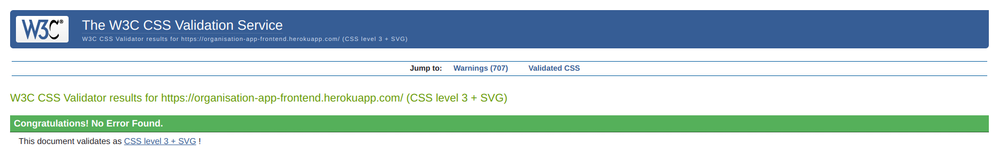
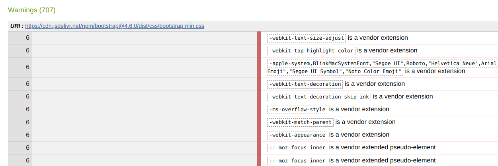

# Testing

[Return to the main README](README.md)

### W3C HTML

The [W3C HTL validation service](https://validator.w3.org/) was used to check the validity of HTML in the application.

### W3C CSS

The [W3C CSS validation service](https://jigsaw.w3.org/css-validator/) was used to check the validity of CSS in the application. No errors were found with the CSS in the application/

    

There were, however, 707 warnings generated for the applcation. However, all of these warnings come from the import of bootstrap in the project:

### ESLint

### Automatic Testing

## Manual Testing

### Components

 

See testing

| Component          | Login state | Expected result                                                                    | Passes testing? |
| ------------------ | ----------- | ---------------------------------------------------------------------------------- | --------------- |
| Navbar             | any         | All links in main navbar lead to correct URIs                                      | &check;         |
| Navbar             | logged out  | Cannot see restricted links in navbar                                              | &check;         |
| Navbar             | logged in   | All restricted links in dropdown menu lead to correct URIs                         | &check;         |
| NotFound           | any         | Whenever a page cannot be found, the 404 not found page is displayed               | &check;         |
| Avatar             | any         | Wherever an avatar should be, it is correctly displayed                            | &check;         |
| Asset (no results) | any         | Wherever no results are found, the "not found" asset is correctly displayed        | &check;         |
| Asset (upload)     | any         | Wherever an image can be uploaded, the "image upload" asset is correctly displayed | &check;         |
| Asset (spinner)    | any         | Loading spinner assets are correctly displaed when data is being fetched from API  | &check;         |

### Sign up

These routes address the following user stories:

- As a **visitor** I can **register for an account** so that **I can have a user profile with picture and have full access to the site, make, comment on and like posts and events**

 

See testing

| Login state   | URI      | Expected result             | Passes testing? |
| ------------- | -------- | --------------------------- | --------------- |
| not logged in | /signup/ | renders signin page         | &check;         |
| logged in     | /signup/ | redirects to "/" home route | &check;         |

### Sign in

These routes address the following user stories:

- As a **registered user** I can **log in to my account** so that **I can have full access to the site, make, comment on and like posts and events**

 

See testing

| Login state   | URI      | Expected result             | Passes testing? |
| ------------- | -------- | --------------------------- | --------------- |
| not logged in | /signin/ | renders signin page         | &check;         |
| logged in     | /signin/ | redirects to "/" home route | &check;         |

### Profiles

These routes address the following user stories:

- As a **user** I can **view other user's profiles** so that I can **see a specific user's posts and events**
- As a **user** I can **have a profile created for me, add a profile picture and edit my profile** so that **I can have a custom profile picture and display information about myself**

 

See testing

| Login state           | URI             | Action                       | Expected result                                                   | Passes testing? |
| --------------------- | --------------- | ---------------------------- | ----------------------------------------------------------------- | --------------- |
| any                   | /profiles/      | access non existant route    | redirect to 404 page                                              | &check;         |
| any                   | /profiles/999   | access non-existant resource | redirect to 404 page                                              | &check;         |
| not logged in         | /profiles/{id}/ | view profile                 | view but not edit                                                 | &check;         |
| logged in (not owner) | /profiles/{id}/ | view profile                 | view but not edit                                                 | &check;         |
| logged in (owner)     | /profiles/{id}/ | view profile                 | can view and see edit buttons                                     | &check;         |
| logged in (owner)     | /profiles/{id}/ | edit profile                 | redirect to edit page and can successfully edit                   | &check;         |
| logged in (owner)     | /profiles/{id}/ | edit username                | redirect to username edit page and can successfully edit username | &check;         |
| logged in (owner)     | /profiles/{id}/ | edit password                | redirect to password edit page and can successfully edit password | &check;         |

### Posts

These routes address the following user stories:

- As a **user** I can **view specific posts from another user in their profile** so that **I can see that user's post activity**
- As a **visitor** I can **view a list of posts** so that **I can view recent uploads and decide if I want to sign up**
- As a **visitor** I can **view individual posts** so that **I can read the post in more detail and see the associated comments**
- As a **user or visitor** I can **scroll through a list of posts** so that **I can browse the site more comfortably**
- As a **user** I can **create posts** so that **I can share information about events with other users**
- As a **user** I can **edit or delete my own posts** so that **I can fix incorrect information, add more information, or remove the post entirely**
- As a **user** I can **see posts made specifically by my friends** so that **I can easily access the posts most relevant to me**
- As a **user** I can **access a page containing posts I've liked** so that **I can easily find these posts again**
- As a **user** I can **choose an event from my event list when I post** so that **I can make a post about that specific event**

 

See testing

| Login state                 | URI               | Action                       | Expected result                                                                     | Passes testing? |
| --------------------------- | ----------------- | ---------------------------- | ----------------------------------------------------------------------------------- | --------------- |
| any                         | /posts/           | access non existant route    | 404 page does not exist                                                             | &check;         |
| any                         | /posts/999/       | access non-existant resource | 404 page does not exist                                                             | &check;         |
| not logged in               | /                 | view posts list              | can view posts                                                                      | &check;         |
| logged in                   | /                 | view posts list              | can view posts                                                                      | &check;         |
| not logged in               | /posts/create/    | create post                  | redirect to homepage                                                                | &check;         |
| logged in                   | /posts/create/    | create post                  | redirect to create post form and can successfully add new post                      | &check;         |
| not logged in               | /posts/{id}/      | view post                    | view but not edit or delete                                                         | &check;         |
| logged in (not post owner)  | /posts/{id}/      | view post                    | view but not edit or delete                                                         | &check;         |
| logged in (post owner)      | /posts/{id}/      | view post                    | view and see buttons for edit and delete                                            | &check;         |
| not logged in               | /posts/{id}/edit/ | edit post                    | redirect to homepage                                                                | &check;         |
| logged in (not post owner)  | /posts/{id}/edit/ | edit post                    | redirect to homepage                                                                | &check;         |
| logged in (post owner)      | /posts/{id}/edit/ | edit post                    | redirect to edit post page and can successfully edit                                | &check;         |
| not logged in               | /posts/{id}/edit/ | delete post                  | not possible to delete any posts (redirect to homepage)                             | &check;         |
| logged in (not event owner) | /posts/{id}/edit/ | delete post                  | not possible to delete any posts that do not belong to user (redirects to homepage) | &check;         |
| logged in (post owner)      | /posts/{id}/edit/ | delete post                  | prompts delete confirm modal. On confirmation, deletes selected resource            | &check;         |

### Events

These routes address the following user stories:

- As a **user** I can **view specific events from another user in their profile** so that **I can see that user's events**
- As a **user** I can **choose an event from my event list when I post** so that **I can make a post about that specific event**
- As a **visitor** I can **view public events** so that **I can see what events are planned and see if I would like to create an account to add the event(s) to my calendar**
- As a **visitor** I can **view individual events** so that **I can see more detail about the event and see any associated comments**
- As a **user or visitor** I can **scroll through a list of events** so that **I can browse the site more comfortably**
- As a **user** I can **create events** so that **I can share information about events with other users**
- As a **user** I can **edit or delete my own events** so that **I can fix incorrect information, add more information, or remove the event entirely**
- As a **user** I can **view my friend's events on a seperate page** so that **I can quickly browse events most relevant to me**
- As a **user** I can **see my upcoming events on a sidebar** so that **I can quickly see which of my events are coming up soon**

 

See testing

| Login state                 | URI                     | Action                       | Expected result                                                                | Passes testing? |
| --------------------------- | ----------------------- | ---------------------------- | ------------------------------------------------------------------------------ | --------------- |
| any                         | /events/999/            | access non-existant resource | 404 page does not exist                                                        | &check;         |
| not logged in               | /events/                | view events list             | can view events but not watch/add to calendar                                  | &check;         |
| logged in                   | /events/                | view events list             | can view events                                                                | &check;         |
| not logged in               | /events/create/         | create new event             | redirect to homepage                                                           | &check;         |
| logged in                   | /events/create/         | create new event             | redirect to create event form and can successfully add new event               | &check;         |
| not logged in               | /events/{id}/           | view event                   | view but not watch/add to calendar or edit or delete                           | &check;         |
| logged in (not event owner) | /events/{id}/           | view event                   | view but not edit or delete                                                    | &check;         |
| logged in (event owner)     | /events/{id}/           | view event                   | view and see buttons for edit and delete                                       | &check;         |
| not logged in               | /events/{id}/edit/      | edit event                   | redirect to homepage                                                           | &check;         |
| logged in (not event owner) | /events/{id}/edit/      | edit event                   | redirect to homepage                                                           | &check;         |
| logged in (event owner)     | /events/{id}/edit/      | edit event                   | redirect to edit event page and can successfully edit                          | &check;         |
| not logged in               | /events/{id}/           | delete event                 | not possible to delete any events                                              | &check;         |
| logged in (not event owner) | /events/{id}/           | delete event                 | not possible to delete any events that do not belong to user                   | &check;         |
| logged in (event owner)     | /events/{id}/           | delete event                 | prompts delete confirm modal. On confirmation, deletes selected resource       | &check;         |
| not logged in               | /events/, /events/{id}/ | add event to calendar        | not possible to add events to calendar without logging in first                | &check;         |
| logged in (not event owner) | /events/, /events/{id}/ | add event to calendar        | users who do not own the event may add it to their calendar                    | &check;         |
| logged in (event owner)     | /events/, /events/{id}/ | add event to calendar        | event owners already have the event in their calendar and it cannot be removed | &check;         |

### Calendars

These routes address the following user stories:

- As a **user** I am **automatically assigned a calendar** so that **I can easily view my events**
- As a **user**, **the events I create are automatically added to my calendar** so that **I can immediately visualise them**
- As a **user** I can **add and remove other user's events to/from my calendar** so that **I can visually see when they will take place on my personal calendar**
- As a **user** I can **toggle the view of my calendar between year, month, week and day** so that **I can easily visualise my time and see when events are**
- As a **user** I can **navigate between days, weeks, months and years using directional arrows** so that **I can easily visualise my events in my calendar**
- As a **user** I can **click a day and see the events planned for that day** so that **I can quickly see which (if any) events are taking place on a day**
- As a **user** I have **the option to add an event from my calendar** so that **I can easily create new events**
- As a **user** I can **click an event in my calendar to see the event details** so that **I can easily visualise events in my calendar**
- As a **user** I have **a button to see the specific event when I click in in my calendar** so that **I can view further details, edit and delete it**
- As a **user** I can **syncronise my events with my google calendar** so that **I can keep one universal collection of events wherever I am**

 

See testing

| Login state   | URI             | Action                                                      | Expected result                                                                                                       | Passes testing?                                                                                                                                                      |
| ------------- | --------------- | ----------------------------------------------------------- | --------------------------------------------------------------------------------------------------------------------- | -------------------------------------------------------------------------------------------------------------------------------------------------------------------- |
| any           | /calendar/{id}/ | access specific calendar by id (access non existant route ) | 404 page does not exist                                                                                               | &check;                                                                                                                                                              |
| not logged in | /calendar/      | access calendar                                             | redirect to homepage                                                                                                  | &check; During testing, this was found not to redirect, but to just display the spinner forever. The useRedirect custom hook was added on the page to fix the issue. |
| logged in     | /calendar/      | access calendar                                             | events in user's calendar are displayed                                                                               | &check;                                                                                                                                                              |
| logged in     | /calendar/      | user clicks event                                           | event modal pops up with details of specific event. Can click view event to be redirected to event detail view        | &check;                                                                                                                                                              |
| logged in     | /calendar/      | user clicks day                                             | day modal pops up with all events that will occur on that day. Can click add event to be redirected to add event page | &check;                                                                                                                                                              |
| logged in     | /calendar/      | user changes calendar view                                  | calendar changes to that view (year, month, week or day view)                                                         | &check;                                                                                                                                                              |
| logged in     | /calendar/      | user uses navigation arrows                                 | user can scroll through years/months/weeks/days depending on which view they are in                                   | &check;                                                                                                                                                              |
| logged in     | /calendar/      | user clicks "today"                                         | calendar focuses on today in                                                                                          | &check;                                                                                                                                                              |

### Comments

These routes address the following user stories:

- As a **user** I can **create comments on posts** so that **I can communicate with the poster and other users about the post content**
- As a **user** I can **edit and delete my own comments** so that **I can amend or remove the comment I wrote**

 

See testing

| Login state           | URI         | Action                                         | Expected result                                                                                  | Passes testing? |
| --------------------- | ----------- | ---------------------------------------------- | ------------------------------------------------------------------------------------------------ | --------------- |
| any                   | /comments/  | view all comments (access non existant route ) | 404 page does not exist                                                                          | &check;         |
| not logged in         | /post/{id}/ | view comment                                   | can view comments for specific post but cannot add, edit or delete comments                      | &check;         |
| logged in (not owner) | /post/{id}/ | view comment                                   | can view comment but cannot edit or delete if not owner                                          | &check;         |
| logged in (owner)     | /post/{id}/ | view comment                                   | user can see comment and edit and delete buttons                                                 | &check;         |
| not logged in         | /post/{id}/ | edit comment                                   | not possible to edit any comments                                                                | &check;         |
| logged in (not owner) | /post/{id}/ | edit comment                                   | not possible to edit any comments that do not belong to user                                     | &check;         |
| logged in (owner)     | /post/{id}/ | edit comment                                   | user can edit comment they own - comment edit form is rendered                                   | &check;         |
| not logged in         | /post/{id}/ | delete comment                                 | not possible to delete any comments                                                              | &check;         |
| logged in (not owner) | /post/{id}/ | delete comment                                 | not possible to delete any comments that do not belong to user                                   | &check;         |
| logged in (owner)     | /post/{id}/ | delete comment                                 | user can delete comment they own - delete modal is rendered and if confirmed, comment is deleted | &check;         |

### Likes

These routes address the following user stories:

- As a **user** I can **like other user's posts** so that **I can show that user I appreciated their content**
- As a **user** I can **access a page containing posts I've liked** so that **I can easily find these posts again**

 

See testing

| Login state                | URI          | Action                                     | Expected result                                                                                       | Passes testing? |
| -------------------------- | ------------ | ------------------------------------------ | ----------------------------------------------------------------------------------------------------- | --------------- |
| any                        | /likes/      | view all likes (access non existant route) | 404 page does not exist                                                                               | &check;         |
| not logged in              | /posts/{id}/ | add/remove like                            | users must be logged in to like a post                                                                | &check;         |
| logged in (post owner)     | /posts/{id}/ | add/remove like                            | post owners cannot like their own posts                                                               | &check;         |
| logged in (not post owner) | /posts/{id}/ | add/remove like                            | users can like or dislike any post they do not own. If they like it, the like icon turns solid purple | &check;         |
| any                        | /posts/{id}/ | add/remove like                            | post like count increases/decreases by 1 when added/removed                                           | &check;         |

### Memories

These routes address the following user stories:

- As a **user** I can **add memories to past events** so that **I can store my comments and images to look at later**
- As a **user** I can **edit or delete my own memories** so that **I can fix incorrect information, add more information, or remove the memory entirely**
- As a **user** I can **add plans to future events** so that **I can plan my event more effectively and store useful information together**
- As a **user** I can **edit or delete my own plans** so that **I can fix incorrect information, add more information, or remove the plan entirely**
- As a **user** I can **switch between plans and memories** so that **I can see all information associated with an event**

 

See testing

| Login state           | URI           | Action                                        | Expected result                                                                                | Passes testing? |
| --------------------- | ------------- | --------------------------------------------- | ---------------------------------------------------------------------------------------------- | --------------- |
| any                   | /memories/    | view all memories (access non existant route) | 404 page does not exist                                                                        | &check;         |
| not logged in         | /events/{id}/ | view memory                                   | can view memories for specific post but cannot add, edit or delete memories                    | &check;         |
| logged in (not owner) | /events/{id}/ | view memory                                   | can view memory but cannot edit or delete if not owner                                         | &check;         |
| logged in (owner)     | /events/{id}/ | view memory                                   | user can see memory and edit and delete buttons                                                | &check;         |
| not logged in         | /events/{id}/ | edit memory                                   | not possible to edit any memories                                                              | &check;         |
| logged in (not owner) | /events/{id}/ | edit memory                                   | not possible to edit any memories that do not belong to user                                   | &check;         |
| logged in (owner)     | /events/{id}/ | edit memory                                   | user can edit memory they own - memory edit form is rendered                                   | &check;         |
| not logged in         | /events/{id}/ | delete memory                                 | not possible to delete any memories                                                            | &check;         |
| logged in (not owner) | /events/{id}/ | delete memory                                 | not possible to delete any memories that do not belong to user                                 | &check;         |
| logged in (owner)     | /events/{id}/ | delete memory                                 | user can delete memory they own - delete modal is rendered and if confirmed, memory is deleted | &check;         |

### Watches

These routes address the following user stories:

- As a **user** I can **watch/unwatch other user's posts** so that **it is added to my watched events list**
- As a **user** I can **view my watched events on a seperate page** so that **I can keep an eye on the event and easily find it again**

 

See testing

| Login state                 | URI           | Action                                       | Expected result                                      | Passes testing? |
| --------------------------- | ------------- | -------------------------------------------- | ---------------------------------------------------- | --------------- |
| any                         | /watches/     | view all watches (access non existant route) | 404 page does not exist                              | &check;         |
| not logged in               | /events/{id}/ | add/remove watch                             | users must be logged in to watch a event             | &check;         |
| logged in (event owner)     | /events/{id}/ | add/remove watch                             | event owners cannot watch their own events           | &check;         |
| logged in (not event owner) | /events/{id}/ | add/remove watch                             | users can watch or unwatch any event they do not own | &check;         |

### Friends (Followers in API)

These routes address the following user stories:

- As a **user** I can **add other users as friends** so that **I can preferentially see their posts and events**
- As a **user** I can **view all the users I have added as a friend** so that **I can easily see them, access their profile or remove them**
- As a **user** I can **see posts made specifically by my friends** so that **I can easily access the posts most relevant to me**
- As a **user** I can **see popular profiles on the side panel on the posts page** so that **I can decide who to add as a friend**
- As a **user** I can **view my friend's events on a seperate page** so that **I can quickly browse events most relevant to me**

 

See testing

| Login state   | URI                           | Action                    | Expected result                                               | Passes testing? |
| ------------- | ----------------------------- | ------------------------- | ------------------------------------------------------------- | --------------- |
| any           | /followers/                   | access non existant route | 404 page does not exist                                       | &check;         |
| not logged in | /, /profiles/{id}/, /friends/ | add/remove friend         | users must be logged in to add/remove friends                 | &check;         |
| logged in     | /, /profiles/{id}/, /friends/ | add/remove friend         | users can add/remove any profile as a friend except their own | &check;         |

### Responsiveness

The responsive design tests were carried out manually throughout the build using Google Chrome Dev Tools.

Three main breakpoint values were used for testing -

### Browser Compatibility

### Lighthouse

### Bugs

Resolved
Many bugs were found and resolved throughout the development of the app. These were recorded using the standard "Bug report" issue template in Github.

| Issue # | Bug title                                                                                                                                                       | Resolved |
| :-----: | :-------------------------------------------------------------------------------------------------------------------------------------------------------------- | :------- |
|   46    | [Past events page doesn't render "no results found"](https://github.com/dragon-fire-fly/organisation_app_frontend/issues/46)                                    | &check;  |
|   47    | [Unable to edit post without adding event](https://github.com/dragon-fire-fly/organisation_app_frontend/issues/47)                                              | &check;  |
|   48    | [When a post is edited, the event cannot be left unchanged ](https://github.com/dragon-fire-fly/organisation_app_frontend/issues/48)                            | &check;  |
|   49    | [Cannot upload a post or event without an image](https://github.com/dragon-fire-fly/organisation_app_frontend/issues/49)                                        | &check;  |
|   50    | [404 page not rendering when an unknown resource is called from a valid path](https://github.com/dragon-fire-fly/organisation_app_frontend/issues/50)           | &check;  |
|   51    | [Editing an image in the edit memory form changes the image in the memory create form ](https://github.com/dragon-fire-fly/organisation_app_frontend/issues/51) | &check;  |
|   52    | [Cannot add an image when memory is edited if no image in original memory ](https://github.com/dragon-fire-fly/organisation_app_frontend/issues/52)             | &check;  |
|   53    | [Last image added to memory not cleared from form](https://github.com/dragon-fire-fly/organisation_app_frontend/issues/53)                                      | &check;  |

### Accessibility
